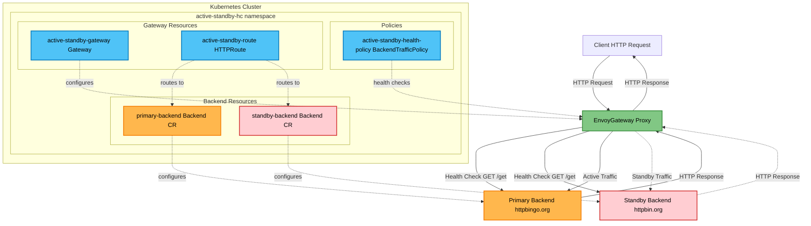
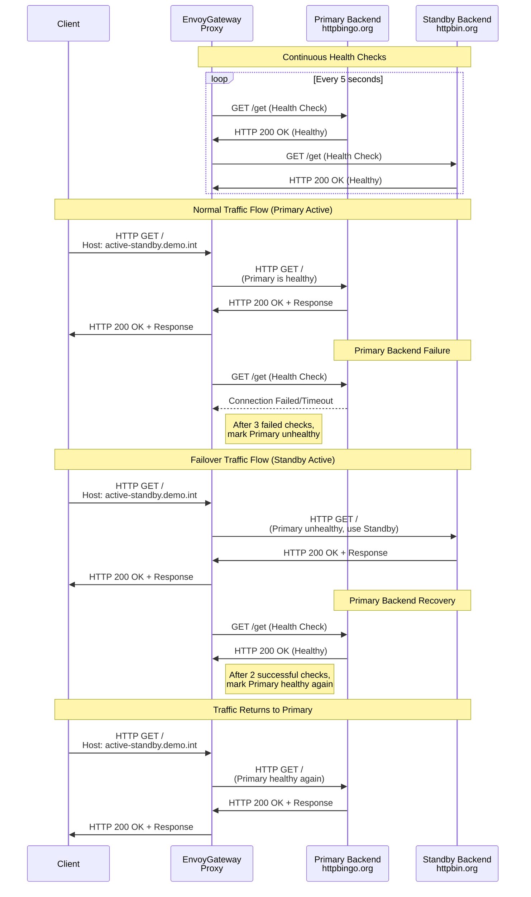

# Active-Standby Health Check Use Case

This use case demonstrates EnvoyGateway's active health checking capabilities with Backend resources in an active-standby configuration.

## Overview

In this scenario:
- **Primary Backend** serves as the active endpoint (httpbingo.org)
- **Standby Backend** serves as the fallback endpoint (httpbin.org)
- **Health Checks** continuously monitor backend availability
- **Automatic Failover** switches traffic when primary backend fails health checks

## Architecture



**Legend:**
- 🔵 **Gateway API Resources** (blue): Gateway, HTTPRoute, BackendTrafficPolicy
- 🟢 **Physical Components** (green): EnvoyGateway proxy
- 🟠 **Active Backend** (orange): Primary backend and Backend CR
- 🔴 **Standby Backend** (red): Standby backend and Backend CR

## Components

- **GatewayClass**: Standard EnvoyGateway class
- **Gateway**: HTTP listener for client traffic
- **HTTPRoute**: Routes traffic to Backend resources
- **Backend Resources**: Primary and standby external endpoints
- **BackendTrafficPolicy**: Configures health checks and load balancing

## Prerequisites

- EnvoyGateway installed (Backend API extension enabled by default)
- Backend API CRDs available

## Files

- `namespace.yaml` - Dedicated namespace for the use case
- `backend.yaml` - Primary and standby Backend resources
- `gateway.yaml` - Gateway and HTTPRoute configuration
- `backend-traffic-policy.yaml` - Health check and traffic policy
- `deploy.sh` - Deployment script
- `test.sh` - Testing script

## Deploy

```bash
cd use-cases/active-standby-hc
./deploy.sh
```

## Test

The deployment script provides comprehensive testing instructions. Key testing points:

- **Hostname**: `active-standby.demo.int`
- **Port**: `18080`
- **Health Check**: GET /get every 5s with 3s timeout

```bash
# Quick test with port-forward
kubectl port-forward -n envoy-gateway-system svc/$GATEWAY_SERVICE 18080:18080 &
curl -H 'Host: active-standby.demo.int' http://localhost:18080/get
```

## Health Check Flow



## Key Features Demonstrated

- **Active Health Checking**: Continuous monitoring of backend endpoints
- **Automatic Failover**: Traffic switches to standby when primary fails
- **Backend API**: External endpoints defined as Backend custom resources
- **Configurable Thresholds**: Customizable healthy/unhealthy thresholds
- **Load Balancing**: Round-robin distribution among healthy backends

## Configuration Details

### Health Check Settings
The BackendTrafficPolicy configures:
- **Interval**: 5 seconds between health checks
- **Timeout**: 3 seconds per health check request
- **Unhealthy Threshold**: 3 consecutive failures mark backend unhealthy
- **Healthy Threshold**: 2 consecutive successes mark backend healthy
- **Panic Threshold**: 50% - prevents all backends from being marked unhealthy

### Backend Endpoints
- **Primary Backend**: httpbingo.org (active endpoint)
- **Standby Backend**: httpbin.org (fallback endpoint)
- **Load Balancing**: Round-robin distribution among healthy backends

## Cleanup

```bash
kubectl delete -f .
```