# Backend mTLS Use Case

This use case demonstrates EnvoyGateway establishing mTLS connections to backend services using BackendTLSPolicy.

## Overview

In this scenario:
- **Client** sends HTTP requests to EnvoyGateway
- **EnvoyGateway** terminates client connection and establishes mTLS to backend
- **Backend** (httpbin-tls) requires client certificates for mTLS authentication
- **Certificates** are managed by cert-manager with proper CA chain

## Architecture


**Legend:**
- 🔵 **Gateway API Resources** (blue): Gateway, HTTPRoute, BackendTLSPolicy
- 🟢 **Physical Components** (green): EnvoyGateway proxy, Backend applications  
- 🟠 **Secrets/Certificates** (orange): TLS certificates and keys
```

## Components

- **GatewayClass**: Standard EnvoyGateway class
- **Gateway**: HTTP listener for client traffic
- **HTTPRoute**: Routes traffic to httpbin-tls backend
- **BackendTLSPolicy**: Configures mTLS to backend service
- **Certificates**: Client cert for EG, server cert for backend

## Prerequisites

- EnvoyGateway installed with cert-manager
- httpbin-tls application deployed

## Files

- `certificates.yaml` - Client certificates for EnvoyGateway
- `gateway.yaml` - Gateway and HTTPRoute configuration
- `backend-tls-policy.yaml` - BackendTLSPolicy for mTLS
- `deploy.sh` - Deployment script
- `test.sh` - Testing script

## Deploy

```bash
cd use-cases/backend-mtls
./deploy.sh
```

## Test

The deployment script provides comprehensive testing instructions. Key testing points:

- **Hostname**: `mtls-backend.demo.int`
- **Port**: `18080`
- **Protocol**: HTTP (client to gateway), mTLS (gateway to backend)

```bash
# Quick test with port-forward
kubectl port-forward -n envoy-gateway-system svc/$GATEWAY_SERVICE 18080:18080 &
curl -H 'Host: mtls-backend.demo.int' http://localhost:18080/get
```

## mTLS Flow

```mermaid
sequenceDiagram
    participant Client
    participant EnvoyGateway as EnvoyGateway<br/>Proxy
    participant Backend as httpbin-tls<br/>Backend
    
    Note over Client,Backend: Client Request (HTTP)
    Client->>EnvoyGateway: HTTP GET /get<br/>Host: mtls-backend.demo.int
    
    Note over EnvoyGateway,Backend: mTLS Handshake
    EnvoyGateway->>Backend: TLS ClientHello
    Backend->>EnvoyGateway: TLS ServerHello + Server Certificate
    EnvoyGateway->>Backend: Client Certificate<br/>(envoygateway-client-cert)
    Backend->>EnvoyGateway: Certificate Verification OK
    
    Note over EnvoyGateway,Backend: Encrypted HTTP Request
    EnvoyGateway->>Backend: HTTPS GET /get<br/>(over mTLS)
    Backend->>EnvoyGateway: HTTPS 200 OK + JSON Response<br/>(over mTLS)
    
    Note over Client,EnvoyGateway: HTTP Response
    EnvoyGateway->>Client: HTTP 200 OK + JSON Response
    
    Note right of Backend: Backend validates:<br/>• Client certificate<br/>• Certificate chain<br/>• Certificate not expired
    Note left of EnvoyGateway: EnvoyGateway provides:<br/>• Client certificate<br/>• Validates server cert<br/>• Encrypts traffic
```



## Key Features Demonstrated

- **Backend mTLS**: EnvoyGateway presents client certificate to backend
- **Certificate Management**: Automated cert provisioning via cert-manager
- **TLS Validation**: Backend validates EnvoyGateway's client certificate
- **Policy-based Configuration**: BackendTLSPolicy for TLS settings

## Cleanup

```bash
kubectl delete -f .
```