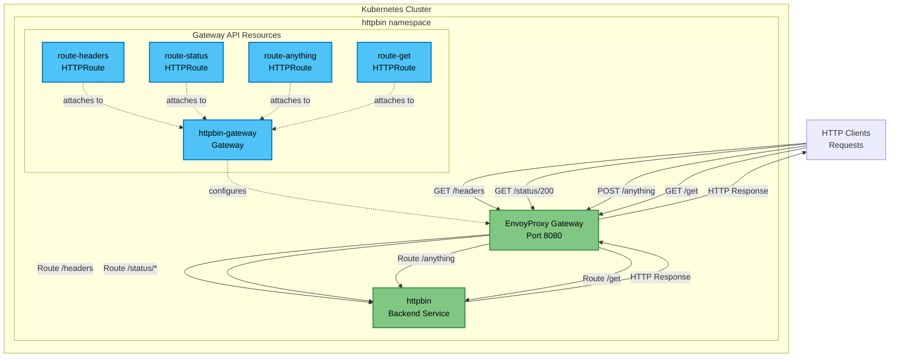

# Basic Routing Use Case

This use case demonstrates basic Gateway and HTTPRoute configuration with multiple path-based routing rules using the httpbin application.

## Overview

In this scenario:
- **Single Gateway** listens for HTTP traffic
- **Multiple HTTPRoute rules** route traffic to different httpbin endpoints based on path prefixes
- **Path-based routing** demonstrates common API gateway patterns

## Architecture



**Legend:**
- **Gateway API Resources** (blue): Gateway, HTTPRoute objects
- **Physical Components** (green): EnvoyGateway proxy, Backend application

## Components

- **Gateway**: Single gateway listening on port 8080
- **HTTPRoutes**: Four separate routes demonstrating different path patterns:
  - `/headers` - Returns request headers
  - `/status/*` - Returns specific HTTP status codes
  - `/anything` - Echoes back request data (accepts any HTTP method)
  - `/get` - Simple GET endpoint

## Prerequisites

- EnvoyGateway installed
- Default GatewayClass `eg` available
- httpbin application deployed

## Files

- `gateway.yaml` - Gateway configuration
- `httproute.yaml` - HTTPRoute configurations for multiple paths
- `deploy.sh` - Deployment script
- `test.sh` - Testing script

## Deploy

```bash
cd use-cases/basic-routing
./deploy.sh
```

## Test

The test script validates all routing rules:

```bash
./test.sh
```

### Manual Testing

```bash
# Port forward to the gateway
kubectl port-forward -n httpbin service/$(kubectl get service -n httpbin -l gateway.envoyproxy.io/owning-gateway-name=httpbin-gateway -o jsonpath='{.items[0].metadata.name}') 8080:8080 &

# Test different paths
curl http://localhost:8080/get
curl http://localhost:8080/headers
curl http://localhost:8080/status/200
curl http://localhost:8080/status/404
curl -X POST http://localhost:8080/anything -d '{"test": "data"}'
curl http://localhost:8080/ip
```

## Configuration Details

### Path-Based Routing
Each HTTPRoute demonstrates a different routing pattern:

1. **Exact Path Match** (`/get`): Routes only exact path matches
2. **Prefix Path Match** (`/headers`, `/status/`, `/anything`): Routes all paths starting with the prefix

### HTTPRoute Structure
Each route:
- Attaches to the same parent Gateway
- Defines path matching rules
- Points to the httpbin backend service in the same namespace

## Key Features Demonstrated

- **Basic Gateway Configuration**: Single gateway listening on HTTP port
- **Multiple HTTPRoutes**: Independent routing rules for different paths
- **Path-Based Routing**: Both exact and prefix path matching
- **Same-Namespace Routing**: Gateway, routes, and backend all in the httpbin namespace

## Cleanup

```bash
kubectl delete -f .
```

## What's Next?

After mastering basic routing, explore:
- **Merged Gateway** (`use-cases/merged-gateway`): Multiple gateways sharing infrastructure
- **Backend mTLS** (`use-cases/backend-mtls`): Secure backend communication
- **Active-Standby Health Checks** (`use-cases/active-standby-hc`): Traffic management with health checks
