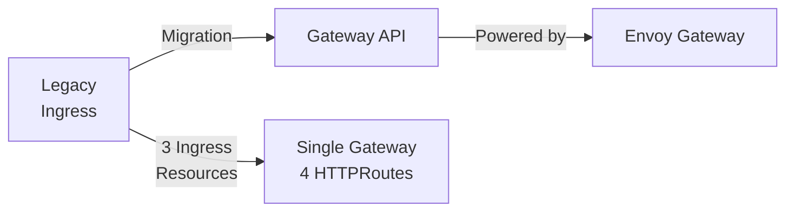
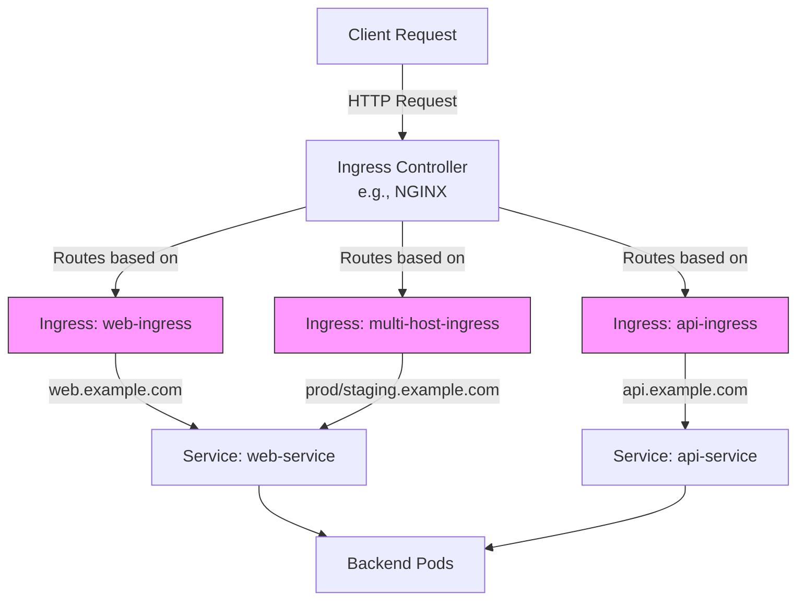
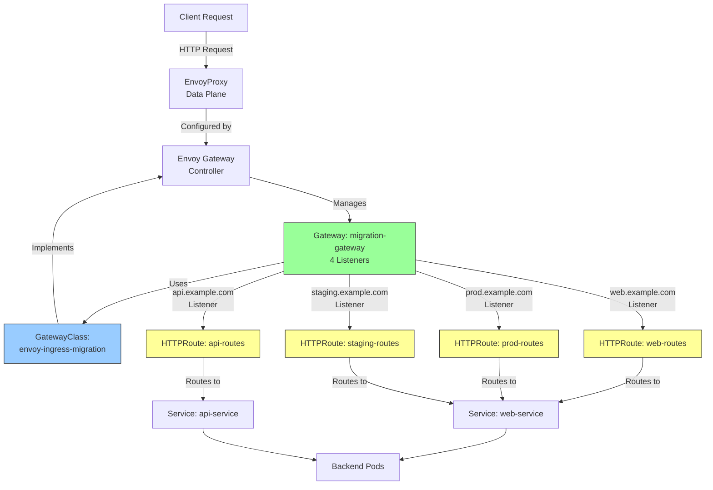
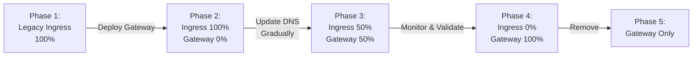

# Ingress to Gateway API Migration Guide

A comprehensive, step-by-step guide for migrating from traditional Kubernetes Ingress resources to the modern Gateway API with Envoy Gateway.

## Table of Contents

- [Overview](#overview)
- [What is This Migration?](#what-is-this-migration)
- [Why Migrate to Gateway API?](#why-migrate-to-gateway-api)
- [Architecture Comparison](#architecture-comparison)
- [Prerequisites](#prerequisites)
- [Step-by-Step Migration Guide](#step-by-step-migration-guide)
- [Understanding the Transformation](#understanding-the-transformation)
- [Testing the Migration](#testing-the-migration)
- [Migration Best Practices](#migration-best-practices)
- [Rollback Strategy](#rollback-strategy)
- [Next Steps](#next-steps)

## Overview

This use case demonstrates the complete process of migrating from Kubernetes Ingress resources to Gateway API using Envoy Gateway. It provides:

- **Side-by-side comparison** of Ingress vs Gateway API
- **Automated migration** with validation scripts
- **Real-world scenarios** including multi-host routing and path rewrites
- **Production-ready patterns** for gradual migration

## What is This Migration?

The migration journey moves your traffic routing configuration from:

**FROM:** Traditional Kubernetes Ingress resources
- Ingress objects with controller-specific annotations
- Tightly coupled to specific Ingress Controller implementations
- Limited routing capabilities

**TO:** Modern Gateway API with Envoy Gateway
- Standardized, vendor-neutral API
- Role-oriented design (platform vs application teams)
- Rich feature set for advanced routing



## Why Migrate to Gateway API?

### Key Benefits

| Feature | Ingress | Gateway API |
|---------|---------|-------------|
| **Portability** | Controller-specific annotations | Standard, portable configuration |
| **Role Separation** | Mixed infrastructure/app config | Clear Gateway (infra) vs Route (app) separation |
| **Advanced Routing** | Limited, annotation-based | Native support for headers, weights, rewrites |
| **Multi-Protocol** | HTTP/HTTPS only | HTTP, HTTPS, TCP, gRPC, TLS passthrough |
| **Traffic Management** | Basic | Traffic splitting, mirroring, retries, timeouts |
| **Extension Points** | Annotations | Type-safe policy attachments |
| **Community** | Fragmented | Unified Kubernetes SIG |

### Real-World Impact

- **Reduced Lock-in**: Switch between gateway implementations without config changes
- **Team Autonomy**: Platform teams manage Gateways, app teams manage Routes
- **GitOps Friendly**: Strongly-typed resources with better validation
- **Future-Proof**: Kubernetes SIG standard with active development

## Architecture Comparison

### Before: Ingress Architecture



**Characteristics:**
- Multiple Ingress resources (3 in this example)
- Controller-specific annotations for advanced features
- Flat configuration hierarchy
- Limited routing capabilities

### After: Gateway API Architecture



**Characteristics:**
- Single Gateway with multiple listeners (role-based separation)
- One HTTPRoute per application/team
- Standard features without vendor-specific annotations
- Rich routing capabilities built-in

## Prerequisites

Before starting the migration, ensure you have:

1. **Kubernetes Cluster** (v1.26+)
   ```bash
   kubectl version --short
   ```

2. **Envoy Gateway Installed** (v1.5.0+)
   ```bash
   # Check installation
   kubectl get deployment -n envoy-gateway-system
   ```

3. **Gateway API CRDs** (installed with Envoy Gateway)
   ```bash
   # Verify CRDs
   kubectl get crd gateways.gateway.networking.k8s.io
   kubectl get crd httproutes.gateway.networking.k8s.io
   kubectl get crd gatewayclasses.gateway.networking.k8s.io
   ```

4. **Required Tools**
   - `kubectl` (v1.26+)
   - `curl` for testing
   - `ingress2gateway` tool for automated conversion (highly recommended)

### Quick Setup

If you don't have Envoy Gateway installed:

```bash
# From repository root
task setup-all
```

This will:
- Create a Kind cluster (if needed)
- Install Envoy Gateway via Helm
- Install cert-manager
- Install ingress2gateway tool
- Verify installation

### Installing ingress2gateway

The `ingress2gateway` tool automates the conversion of Ingress resources to Gateway API format. It's included when you run `task install-deps`.

**Manual Installation:**

```bash
# macOS
brew install kubernetes-sigs/ingress2gateway/ingress2gateway

# Linux (download latest release)
INGRESS2GATEWAY_VERSION=$(curl -s https://api.github.com/repos/kubernetes-sigs/ingress2gateway/releases/latest | grep '"tag_name"' | sed -E 's/.*"v([^"]+)".*/\1/')
curl -Lo ingress2gateway.tar.gz "https://github.com/kubernetes-sigs/ingress2gateway/releases/download/v${INGRESS2GATEWAY_VERSION}/ingress2gateway_${INGRESS2GATEWAY_VERSION}_linux_amd64.tar.gz"
tar -xzf ingress2gateway.tar.gz ingress2gateway
sudo mv ingress2gateway /usr/local/bin/
rm -f ingress2gateway.tar.gz

# Verify installation
ingress2gateway version
```

**Two Ways to Use This Guide:**

1. **Automated (Recommended for Learning)**: Use the `ingress2gateway` tool to see automatic conversion
   ```bash
   ./convert-with-ingress2gateway.sh
   ```

2. **Manual (Recommended for Production)**: Follow the step-by-step guide below to understand each transformation

## Using the Automated ingress2gateway Tool

Before following the manual migration steps, you can see automated conversion in action:

```bash
cd use-cases/ingress-migration

# Run the automated conversion demonstration
./convert-with-ingress2gateway.sh
```

This script will:
1. ✅ Verify `ingress2gateway` is installed
2. ✅ Deploy sample Ingress resources
3. ✅ Convert them using `ingress2gateway print`
4. ✅ Show side-by-side comparison
5. ✅ Explain the transformation process
6. ✅ Save converted resources to `converted-output/`

**Output Example:**
```yaml
# ingress2gateway automatically generates:
# - GatewayClass
# - Gateway with appropriate listeners
# - HTTPRoute for each Ingress rule
# - Proper path matching and filters
```

**Benefits of Using ingress2gateway:**
- 🚀 Fast conversion of existing Ingress resources
- 🎯 Handles common patterns and annotations
- 📝 Generates syntactically correct Gateway API resources
- 🔄 Supports both cluster-based and file-based conversion
- ✅ Validates output against Gateway API schema

**When to Use Manual Conversion:**
While `ingress2gateway` is excellent for initial conversion, manual review and optimization is recommended for:
- Complex routing requirements
- Custom policies and extensions
- Multi-environment configurations
- Production deployments requiring fine-tuning

## Step-by-Step Migration Guide (Manual Process)

### Phase 1: Understand Your Current Ingress Configuration

Before making changes, document your existing setup:

```bash
# List all Ingress resources
kubectl get ingress -A

# Export current Ingress configurations
kubectl get ingress -n your-namespace -o yaml > ingress-backup.yaml
```

**In this demo:**
- We have 3 Ingress resources in `ingress-demo` namespace
- Routes: `web.example.com`, `api.example.com`, `prod.example.com`, `staging.example.com`
- Features: path-based routing, host-based routing, path rewrites

### Phase 2: Deploy the Demo Environment

```bash
# Deploy legacy Ingress resources and backends
./deploy.sh
```

This script will:
1. ✅ Create namespace and deploy backend services
2. ✅ Deploy 3 legacy Ingress resources
3. ✅ Deploy equivalent Gateway API resources
4. ✅ Validate the migration

**Expected Output:**
```
═══════════════════════════════════════════════════════════════
PHASE 1: Deploy Legacy Ingress Resources (Pre-Migration State)
═══════════════════════════════════════════════════════════════
...
PHASE 3: Migrate to Gateway API with Envoy Gateway
...
✓ Successfully demonstrated Ingress to Gateway API migration
```

### Phase 3: Analyze the Legacy Configuration

Review the deployed Ingress resources:

```bash
# View Ingress resources
kubectl get ingress -n ingress-demo

# Detailed view of a specific Ingress
kubectl describe ingress web-ingress -n ingress-demo
```

**Key observations:**
- Multiple Ingress objects for different hosts
- Annotations for rewrites: `nginx.ingress.kubernetes.io/rewrite-target`
- IngressClassName: `nginx`

### Phase 4: Understand the Gateway API Resources

Examine the migrated resources:

```bash
# View GatewayClass
kubectl get gatewayclass envoy-ingress-migration

# View Gateway
kubectl get gateway -n ingress-demo
kubectl describe gateway migration-gateway -n ingress-demo

# View HTTPRoutes
kubectl get httproute -n ingress-demo
```

**Key observations:**
- **1 GatewayClass**: Links to Envoy Gateway controller
- **1 Gateway**: Defines 4 listeners (one per hostname)
- **4 HTTPRoutes**: One per application/route pattern

### Phase 5: Compare Resource Mappings

#### Mapping: Ingress → Gateway API

| Legacy Ingress | Gateway API Equivalent | Notes |
|----------------|------------------------|-------|
| `IngressClass` | `GatewayClass` | Defines which controller to use |
| `Ingress` object | `Gateway` + `HTTPRoute` | Split into infrastructure (Gateway) and routing (HTTPRoute) |
| `host` field | Gateway `listener.hostname` + HTTPRoute `hostnames` | More explicit host binding |
| `path` matching | HTTPRoute `matches.path` | Richer matching: Exact, PathPrefix, RegularExpression |
| Annotations for rewrites | HTTPRoute `filters.urlRewrite` | Type-safe, standardized rewrites |
| Backend service | HTTPRoute `backendRefs` | Support for multiple backends with weights |

#### Example Transformation

**Before (Ingress):**
```yaml
apiVersion: networking.k8s.io/v1
kind: Ingress
metadata:
  name: web-ingress
  annotations:
    nginx.ingress.kubernetes.io/rewrite-target: /$2
spec:
  rules:
  - host: web.example.com
    http:
      paths:
      - path: /app(/|$)(.*)
        backend:
          service:
            name: web-service
            port:
              number: 80
```

**After (Gateway API):**
```yaml
# Gateway (managed by platform team)
apiVersion: gateway.networking.k8s.io/v1
kind: Gateway
metadata:
  name: migration-gateway
spec:
  gatewayClassName: envoy-ingress-migration
  listeners:
  - name: web-listener
    hostname: "web.example.com"
    port: 8080
    protocol: HTTP
---
# HTTPRoute (managed by app team)
apiVersion: gateway.networking.k8s.io/v1
kind: HTTPRoute
metadata:
  name: web-routes
spec:
  parentRefs:
  - name: migration-gateway
    sectionName: web-listener
  hostnames:
  - "web.example.com"
  rules:
  - matches:
    - path:
        type: PathPrefix
        value: /app
    filters:
    - type: URLRewrite
      urlRewrite:
        path:
          type: ReplacePrefixMatch
          replacePrefixMatch: /
    backendRefs:
    - name: web-service
      port: 80
```

### Phase 6: Verify the Migration

```bash
# Run comprehensive test suite
./test.sh
```

The test script validates:
- ✅ All backend services are healthy
- ✅ GatewayClass is accepted
- ✅ Gateway is programmed and ready
- ✅ All HTTPRoutes are accepted
- ✅ Gateway Service is created
- ✅ HTTP connectivity through the Gateway

**Expected Output:**
```
═══════════════════════════════════════════════════════════════
TEST SUMMARY
═══════════════════════════════════════════════════════════════
Total Tests: 25+
Passed: 25+
Failed: 0

✓ ALL TESTS PASSED!
The migration from Ingress to Gateway API is successful.
```

### Phase 7: Test HTTP Connectivity

```bash
# Get the Gateway Service
GATEWAY_SERVICE=$(kubectl get svc -n envoy-gateway-system \
  -l "gateway.envoyproxy.io/owning-gateway-name=migration-gateway" \
  -o jsonpath='{.items[0].metadata.name}')

# Port-forward to the Gateway
kubectl port-forward -n envoy-gateway-system svc/$GATEWAY_SERVICE 8080:8080

# Test different routes (in another terminal)
# Web routes
curl -H "Host: web.example.com" http://localhost:8080/status/200
curl -H "Host: web.example.com" http://localhost:8080/app/get

# API routes
curl -H "Host: api.example.com" http://localhost:8080/v1/get
curl -H "Host: api.example.com" http://localhost:8080/v2/headers

# Multi-host routes
curl -H "Host: prod.example.com" http://localhost:8080/
curl -H "Host: staging.example.com" http://localhost:8080/
```

## Understanding the Transformation

### 1. GatewayClass: Infrastructure Configuration

```yaml
apiVersion: gateway.networking.k8s.io/v1
kind: GatewayClass
metadata:
  name: envoy-ingress-migration
spec:
  controllerName: gateway.envoyproxy.io/gatewayclass-controller
```

**Purpose:**
- Defines which Gateway controller handles this class
- Typically managed by cluster administrators
- Equivalent to `IngressClass` but more powerful

### 2. Gateway: Network Entry Point

```yaml
apiVersion: gateway.networking.k8s.io/v1
kind: Gateway
metadata:
  name: migration-gateway
  namespace: ingress-demo
spec:
  gatewayClassName: envoy-ingress-migration
  listeners:
  - name: web-listener
    protocol: HTTP
    port: 8080
    hostname: "web.example.com"
  # ... more listeners
```

**Key Concepts:**
- **Listeners**: Each listener is a network entry point (IP:port + hostname)
- **Protocol**: Supports HTTP, HTTPS, TCP, TLS, gRPC
- **Hostname**: Optional host-based filtering
- **Role**: Managed by platform/infrastructure team

### 3. HTTPRoute: Application Routing Rules

```yaml
apiVersion: gateway.networking.k8s.io/v1
kind: HTTPRoute
metadata:
  name: web-routes
  namespace: ingress-demo
spec:
  parentRefs:
  - name: migration-gateway
    sectionName: web-listener  # Binds to specific listener
  hostnames:
  - "web.example.com"
  rules:
  - matches:
    - path:
        type: PathPrefix
        value: /app
    filters:
    - type: URLRewrite
      urlRewrite:
        path:
          type: ReplacePrefixMatch
          replacePrefixMatch: /
    backendRefs:
    - name: web-service
      port: 80
```

**Key Concepts:**
- **ParentRefs**: Attaches to Gateway listeners
- **Hostnames**: Must match listener hostnames
- **Matches**: Rich matching on path, headers, query params
- **Filters**: Request/response transformation
- **BackendRefs**: Target services with optional weights
- **Role**: Managed by application teams

## Testing the Migration

### Automated Testing

Run the comprehensive test suite:

```bash
cd use-cases/ingress-migration
./test.sh
```

### Manual Testing

```bash
# 1. Check resource status
kubectl get gatewayclass
kubectl get gateway -n ingress-demo
kubectl get httproute -n ingress-demo

# 2. Verify Gateway is programmed
kubectl describe gateway migration-gateway -n ingress-demo

# 3. Check HTTPRoute status
kubectl describe httproute web-routes -n ingress-demo

# 4. Test connectivity
GATEWAY_SERVICE=$(kubectl get svc -n envoy-gateway-system \
  -l "gateway.envoyproxy.io/owning-gateway-name=migration-gateway" \
  -o jsonpath='{.items[0].metadata.name}')

kubectl port-forward -n envoy-gateway-system svc/$GATEWAY_SERVICE 8080:8080 &

# Test endpoints
curl -v -H "Host: web.example.com" http://localhost:8080/status/200
curl -v -H "Host: api.example.com" http://localhost:8080/v1/get
```

### Troubleshooting

#### Gateway Not Programmed

```bash
# Check Gateway status
kubectl describe gateway migration-gateway -n ingress-demo

# Check GatewayClass
kubectl describe gatewayclass envoy-ingress-migration

# Check Envoy Gateway logs
kubectl logs -n envoy-gateway-system -l control-plane=envoy-gateway
```

#### HTTPRoute Not Accepted

```bash
# Check HTTPRoute status
kubectl describe httproute web-routes -n ingress-demo

# Common issues:
# - parentRef doesn't match Gateway name
# - hostname doesn't match listener hostname
# - namespace mismatch
```

#### No Connectivity

```bash
# Verify Gateway Service exists
kubectl get svc -n envoy-gateway-system \
  -l "gateway.envoyproxy.io/owning-gateway-name=migration-gateway"

# Check Envoy proxy logs
kubectl logs -n envoy-gateway-system -l gateway.envoyproxy.io/owning-gateway-name=migration-gateway

# Verify backend pods are ready
kubectl get pods -n ingress-demo
```

## Migration Best Practices

### 1. Gradual Migration Strategy

**Don't:** Switch everything at once
**Do:** Run Ingress and Gateway API in parallel



**Implementation:**
```bash
# 1. Deploy Gateway API resources alongside existing Ingress
kubectl apply -f gateway-api-resources.yaml

# 2. Update DNS or LoadBalancer to split traffic
#    - 90% to Ingress, 10% to Gateway (canary)

# 3. Monitor for issues
#    - Check metrics, logs, error rates

# 4. Gradually increase Gateway traffic
#    - 50/50 split, then 100% to Gateway

# 5. Remove Ingress resources after validation
kubectl delete -f legacy-ingress.yaml
```

### 2. Role-Based Resource Management

| Role | Manages | Resources |
|------|---------|-----------|
| **Platform Team** | Infrastructure, cluster-wide policies | GatewayClass, Gateway |
| **Application Team** | App-specific routing | HTTPRoute, ReferenceGrant |

**Example RBAC:**
```yaml
# Platform team: manage Gateways
apiVersion: rbac.authorization.k8s.io/v1
kind: ClusterRole
metadata:
  name: gateway-admin
rules:
- apiGroups: ["gateway.networking.k8s.io"]
  resources: ["gateways", "gatewayclasses"]
  verbs: ["*"]
---
# App team: manage HTTPRoutes
apiVersion: rbac.authorization.k8s.io/v1
kind: Role
metadata:
  name: route-admin
  namespace: app-namespace
rules:
- apiGroups: ["gateway.networking.k8s.io"]
  resources: ["httproutes"]
  verbs: ["*"]
```

### 3. Use Policy Attachments for Advanced Features

Instead of annotations, use Gateway API policy attachments:

```yaml
# Example: Rate limiting with BackendTrafficPolicy
apiVersion: gateway.envoyproxy.io/v1alpha1
kind: BackendTrafficPolicy
metadata:
  name: rate-limit-policy
  namespace: ingress-demo
spec:
  targetRef:
    group: gateway.networking.k8s.io
    kind: Gateway
    name: migration-gateway
  rateLimit:
    type: Global
    global:
      rules:
      - clientSelectors:
        - headers:
          - name: x-user-id
            type: Distinct
        limit:
          requests: 100
          unit: Minute
```

### 4. Leverage Cross-Namespace Routing

Gateway API supports cross-namespace references with ReferenceGrant:

```yaml
# Allow Gateway in namespace A to route to Service in namespace B
apiVersion: gateway.networking.k8s.io/v1beta1
kind: ReferenceGrant
metadata:
  name: allow-gateway-to-backend
  namespace: backend-namespace
spec:
  from:
  - group: gateway.networking.k8s.io
    kind: HTTPRoute
    namespace: gateway-namespace
  to:
  - group: ""
    kind: Service
```

### 5. Monitor and Observe

```bash
# Gateway status
kubectl get gateway -A -w

# HTTPRoute status
kubectl get httproute -A

# Gateway metrics (if Prometheus is configured)
kubectl port-forward -n envoy-gateway-system svc/envoy-gateway-metrics 8080:8080
curl http://localhost:8080/metrics
```

## Rollback Strategy

If issues arise during migration:

### Quick Rollback

```bash
# 1. Switch DNS/traffic back to Ingress
#    (external to Kubernetes - update LoadBalancer or DNS)

# 2. Keep Gateway API resources for analysis
#    Don't delete immediately - useful for debugging
```

### Full Rollback

```bash
# Remove Gateway API resources
kubectl delete -f 02-gateway-api-migrated.yaml

# Verify Ingress still works
kubectl get ingress -n ingress-demo
```

### Rollback Checklist

- [ ] DNS/traffic switched back to Ingress
- [ ] Monitor error rates and latency
- [ ] Document what went wrong
- [ ] Plan fixes before retry
- [ ] Communicate with stakeholders

## Next Steps

### After Successful Migration

1. **Remove Legacy Ingress Resources**
   ```bash
   kubectl delete ingress --all -n ingress-demo
   ```

2. **Explore Advanced Gateway API Features**
   - Traffic splitting for canary deployments
   - Request/response header manipulation
   - Retry policies and timeouts
   - mTLS to backends (see `../backend-mtls/` use case)
   - Health checking (see `../active-standby-hc/` use case)

3. **Implement GitOps**
   - Commit Gateway API resources to Git
   - Use ArgoCD or Flux for automated deployments
   - Separate repos for Gateways (platform) and HTTPRoutes (apps)

4. **Set Up Monitoring**
   - Configure Prometheus scraping
   - Create Grafana dashboards
   - Set up alerts for Gateway/HTTPRoute status changes

### Additional Resources

- [Envoy Gateway Documentation](https://gateway.envoyproxy.io/)
- [Gateway API Official Site](https://gateway-api.sigs.k8s.io/)
- [ingress2gateway Tool](https://github.com/kubernetes-sigs/ingress2gateway)
- [Envoy Gateway Policy System](https://gateway.envoyproxy.io/docs/api/extension_types/)

### Related Use Cases in This Repository

| Use Case | Description | Path |
|----------|-------------|------|
| **Basic Routing** | Gateway API fundamentals | `../basic-routing/` |
| **Merged Gateway** | Multi-tenant gateway sharing | `../merged-gateway/` |
| **Backend mTLS** | Secure backend communication | `../backend-mtls/` |
| **Active-Standby HC** | Health checking and failover | `../active-standby-hc/` |

## Summary

This migration guide demonstrates:

✅ **Complete migration path** from Ingress to Gateway API
✅ **Side-by-side comparison** of both approaches
✅ **Automated validation** with comprehensive tests
✅ **Production patterns** for gradual rollout
✅ **Role-based design** separating platform and app concerns
✅ **Rich routing features** without vendor lock-in

**Key Takeaway:** Gateway API provides a modern, portable, and feature-rich alternative to Ingress, with clear benefits for teams managing complex routing requirements.

---

## Quick Reference

```bash
# Option 1: Use automated ingress2gateway tool
./convert-with-ingress2gateway.sh

# Option 2: Deploy the full migration demo
./deploy.sh

# Test the migration
./test.sh

# View resources
kubectl get gatewayclass
kubectl get gateway -n ingress-demo
kubectl get httproute -n ingress-demo

# Test connectivity
GATEWAY_SERVICE=$(kubectl get svc -n envoy-gateway-system \
  -l "gateway.envoyproxy.io/owning-gateway-name=migration-gateway" \
  -o jsonpath='{.items[0].metadata.name}')
kubectl port-forward -n envoy-gateway-system svc/$GATEWAY_SERVICE 8080:8080

# Cleanup
kubectl delete -f 02-gateway-api-migrated.yaml
kubectl delete -f 01-ingress-legacy.yaml
kubectl delete namespace ingress-demo
```
