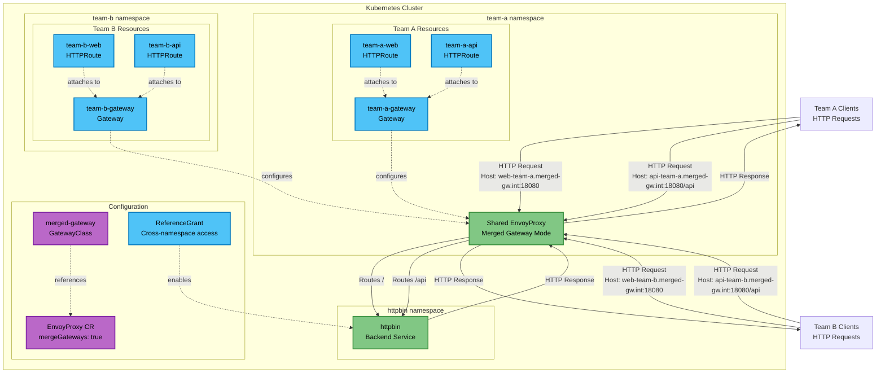

# Merged Gateway Use Case

This use case demonstrates EnvoyGateway's merged gateway mode, which allows multiple Gateway objects to be managed under a single EnvoyProxy deployment.

## Overview

In this scenario:
- **Multiple teams** deploy separate Gateway objects in their own namespaces
- **Single EnvoyProxy** instance serves all Gateway configurations
- **Resource efficiency** through shared proxy infrastructure
- **Multi-tenancy** with namespace isolation and cross-namespace routing

## Architecture



**Legend:**
- 🔵 **Gateway API Resources** (blue): Gateway, HTTPRoute, ReferenceGrant
- 🟢 **Physical Components** (green): EnvoyGateway proxy, Backend applications  
- 🟣 **Configuration Resources** (purple): GatewayClass, EnvoyProxy CR

## Components

- **GatewayClass**: Custom class with merged gateway mode enabled
- **EnvoyProxy**: Configuration resource enabling gateway merging
- **Gateways**: Separate Gateway objects for Team A and Team B
- **HTTPRoutes**: Individual routes for web and API endpoints per team
- **ReferenceGrant**: Enables cross-namespace backend access

## Prerequisites

- EnvoyGateway installed with merged gateway mode enabled
- httpbin application deployed

## Files

- `gatewayclass.yaml` - GatewayClass with EnvoyProxy configuration for merged gateway mode
- `gateways.yaml` - Gateway objects for Team A and Team B
- `httproutes.yaml` - HTTPRoutes for both teams
- `referencegrants.yaml` - Cross-namespace access permissions
- `deploy.sh` - Deployment script
- `test.sh` - Testing script

## Deploy

```bash
cd use-cases/merged-gateway
./deploy.sh
```

## Test

The deployment script provides comprehensive testing instructions. Key testing points:

- **Team A Web**: `web-team-a.merged-gw.int:18080`
- **Team A API**: `api-team-a.merged-gw.int:18080/api`
- **Team B Web**: `web-team-b.merged-gw.int:18080`
- **Team B API**: `api-team-b.merged-gw.int:18080/api`

```bash
# Quick test with port-forward
kubectl port-forward -n envoy-gateway-system service/$(kubectl get service -n envoy-gateway-system -l gateway.envoyproxy.io/owning-gateway-namespace=team-a -o jsonpath='{.items[0].metadata.name}') 18080:18080 &
curl -H "Host: web-team-a.merged-gw.int" http://localhost:18080/get
```


## Configuration Details

### Gateway Merging Settings
- **EnvoyProxy CR**: `mergeGateways: true` enables gateway merging
- **GatewayClass**: Custom class references the EnvoyProxy configuration
- **Shared Infrastructure**: Single proxy serves multiple Gateway objects

### Multi-tenant Setup
- **Team A**: `team-a` namespace with dedicated Gateway and HTTPRoutes
- **Team B**: `team-b` namespace with dedicated Gateway and HTTPRoutes
- **Cross-namespace Access**: ReferenceGrant enables backend access across namespaces

## Key Features Demonstrated

- **Gateway Merging**: Multiple Gateway objects share single EnvoyProxy instance
- **Multi-tenancy**: Team isolation with separate namespaces and Gateway objects
- **Resource Efficiency**: Reduced proxy deployments and resource consumption
- **Cross-namespace Routing**: ReferenceGrant enables backend access across namespaces

## Cleanup

```bash
kubectl delete -f .
```