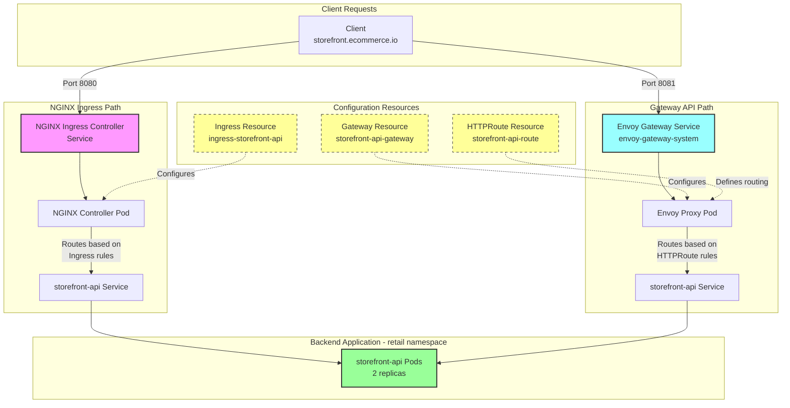

# Ingress NGINX Migration to EnvoyGateway

## Why?

[NGINX Retirement Announcement](https://kubernetes.io/blog/2025/11/11/ingress-nginx-retirement/)

## How to get started
[Envoy Gateway Docs](https://gateway.envoyproxy.io/docs/tasks/quickstart/#installation) <br>

### Configure GatewayClass
```sh
kubectl apply -f gatewayclass.yaml
```

### Ingress2Gateway 
[Install Ingess2Gateway](https://github.com/kubernetes-sigs/ingress2gateway/blob/main/README.md#installation)

### Existing Ingress Resource
Review existing `ingress` resource
```yaml
apiVersion: networking.k8s.io/v1
kind: Ingress
metadata:
  name: ingress-storefront-api
  namespace: retail
spec:
  ingressClassName: nginx
  tls:
  - hosts:
    - storefront.ecommerce.io
    secretName: storefront-tls
  rules:
  - host: storefront.ecommerce.io
    http:
      paths:
      - path: /
        pathType: Prefix
        backend:
          service:
            name: storefront-api
            port:
              number: 80
```

### Run ingress2gateway
We can run `ingress2gateway` in two ways:
1. Run against a cluster
2. Run against a file

```sh
# Run Against Cluster
ingress2gateway print -n retail --providers ingress-nginx

# Run Against File
ingress2gateway print --input-file storefront-ingress.yaml --providers ingress-nginx -n retail
```

Can use above to output to a file and apply against cluster.

## Test and Discover




### NGINX Public IP
```sh
NGINX_GATEWAY_IP=$(kubectl get svc -n ingress-nginx ingress-nginx-controller -o jsonpath='{.status.loadBalancer.ingress[0].ip}')
curl --resolve storefront.ecommerce.io:443:${NGINX_GATEWAY_IP} https://storefront.ecommerce.io/ -k -I  
```


### Envoy Gateway IP
```sh
ENVOY_GATEWAY_IP=$(kubectl get svc -n envoy-gateway-system -l gateway.envoyproxy.io/owning-gateway-name=nginx -o jsonpath='{.items[0].status.loadBalancer.ingress[0].ip}')
curl --resolve storefront.ecommerce.io:443:${ENVOY_GATEWAY_IP} https://storefront.ecommerce.io/ -k -I  
curl --resolve storefront.ecommerce.io:80:${ENVOY_GATEWAY_IP} http://storefront.ecommerce.io/ -k -I  
```
